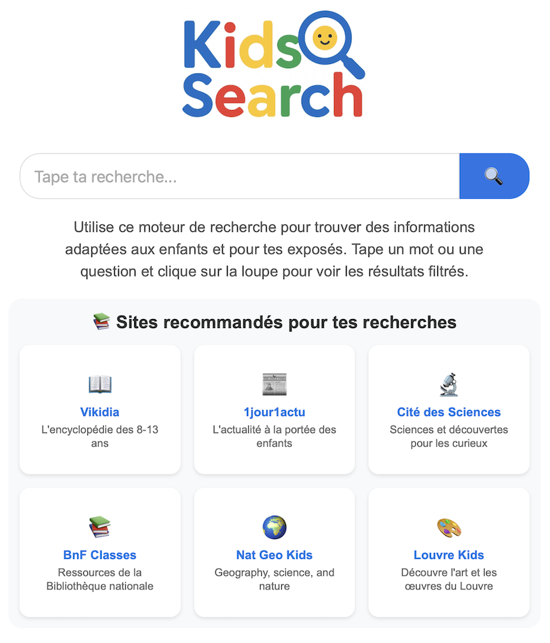

[](https://laurentftech.github.io/kidsearch) [](https://www.buymeacoffee.com/laurentftech)

# KidSearch 🔍

**[➡️ Essayez la démo live !](https://laurentftech.github.io/kidsearch)**

Un moteur de recherche sécurisé et éducatif conçu pour les enfants, utilisant Google Custom Search Engine avec des résultats filtrés et des encarts de connaissances basés sur Vikidia.

C'est une solution idéale pour une **famille, une association ou une école** qui souhaite offrir un environnement de recherche contrôlé et sûr. Vous pouvez même le définir comme moteur de recherche par défaut dans le navigateur pour une expérience totalement intégrée. À titre d'exemple, je l'héberge à la maison sur mon Synology pour offrir une recherche sécurisée à mes enfants.

En l’utilisant combiné avec Google Family Link (ou tout autre système de liste blanche) sur Chrome, vous pouvez limiter l’accès à Internet aux seuls sites adaptés aux enfants que vous choisissez (et bloquer par exemple l’accès direct à google.com).

<p align="center">
  
</p>

## Fonctionnalités

- **Résultats filtrés** : Seuls les sites éducatifs approuvés apparaissent
- **Autocomplétion personnalisée** : Plus de 200 suggestions éducatives avec navigation clavier
- **Sites recommandés** : Sélection de ressources pédagogiques de qualité
- **Recherche d'images** : Mode de recherche d'images avec prévisualisation
- **Recherche vocale** : Effectuez des recherches avec votre voix grâce à l'icône micro.
- **Recherche Hybride** : Combine les résultats de Google CSE avec d'autres sources comme Vikidia, Wikipédia, Wikimedia Commons, et même votre propre instance MeiliSearch.
- **Encarts de connaissances** : Informations contextuelles depuis Vikidia, Wikipédia et Wikimedia Commons pour enrichir les résultats
- **Cache intelligent** : Système de mise en cache pour optimiser les performances et économiser le quota API
- **Gestion du quota** : Surveillance automatique de l'utilisation de l'API Google
- **Priorisation de la langue** : Détection automatique des requêtes en français ou en anglais pour de meilleurs résultats
- **Options de tri** : Tri par pertinence ou par date (pour les résultats web)
- **Design responsive** : Fonctionne sur ordinateur, tablette et mobile
- **Interface enfant** : Design coloré et convivial avec icônes expressives
- **Suggestions en cas d'absence de résultats**: Propose des requêtes alternatives lorsque aucun résultat n'est trouvé
- **Pagination optimisée**: Affiche la pagination de manière efficace pour une expérience plus fluide

## Installation

1. **Clonez le dépôt** :
   ```bash
   git clone [votre-repo]
   cd search-for-kids
   ```

2. **Configuration** :
   ```bash
   cp config.example.js config.js
   ```

3. **Éditez `config.js`** avec votre ID Google Custom Search Engine, votre clé API Google et la configuration des encarts de connaissances :
   ```javascript
   const CONFIG = {
       GOOGLE_CSE_ID: 'votre_id_cse_ici',
       GOOGLE_API_KEY: 'VOTRE_API_KEY_ICI',
       VOICE_SEARCH_ENABLED: true, // Mettre à false pour désactiver la recherche vocale
       KNOWLEDGE_PANEL_CONFIG: {
           ENABLED: true,
           API_URL: 'https://fr.vikidia.org/w/api.php',
           BASE_URL: 'https://fr.vikidia.org/wiki/',
           SOURCE_NAME: 'Vikidia (Encyclopédie des 8-13 ans)',
           EXTRACT_LENGTH: 300,
           THUMBNAIL_SIZE: 150,
           DISABLE_THUMBNAILS: false
       },
       // Optionnel : Ajoutez votre propre instance MeiliSearch pour des résultats personnalisés
       MEILISEARCH_CONFIG: {
           ENABLED: false, // Mettre à true pour activer
           API_URL: 'https://votre-instance-meili.com',
           API_KEY: 'votre_cle_api_recherche_meili',
           INDEX_NAME: 'nom_de_votre_index',
           SOURCE_NAME: 'Ma Source Personnalisée',
           WEIGHT: 0.6, // Ajustez pour prioriser les résultats
           BASE_URLS: ['https://votre-site-web.com'] // Liste des URLs de base des sites indexés (pour les exclure de Google)
       },
       // ... autres configurations pour Wikipedia, Vikidia, etc.
   };
   ```

4. **Hébergez les fichiers sur un serveur web** :
   Ce projet est composé de fichiers statiques et peut être hébergé sur n'importe quel serveur web.

   **Pour le développement local :**
   Vous pouvez utiliser un simple serveur local.
   ```bash
   # Avec Python 3
   python -m http.server 8000
   
   # Ou utilisez l'extension "Live Server" dans VS Code
   ```
   Ensuite, ouvrez `http://localhost:8000` dans votre navigateur.

   **Pour la production :**
   Déployez les fichiers sur n'importe quel hébergeur web statique (par exemple, Synology Web Station, Caddy, Apache, Nginx, AWS, GitHub Pages, etc.).

## Configuration Google CSE

1. Allez sur [Google Custom Search Engine](https://cse.google.com/)
2. Créez un nouveau moteur de recherche
3. Ajoutez vos sites approuvés dans les "Sites à rechercher"
4. Activez la recherche d'images dans les paramètres
5. Récupérez votre ID CSE (format : `xxx:yyyyy`)
6. Obtenez une clé API Google depuis [Google Cloud Console](https://console.cloud.google.com)
7. Collez les identifiants dans `config.js`

**🔒 Conseil de sécurité :** Restreignez votre clé API Google pour empêcher son utilisation non autorisée. Dans votre Google Cloud Console, sous "Identifiants", modifiez votre clé API et définissez les "Restrictions relatives aux applications" sur "Référents HTTP (sites web)". Ajoutez l'URL où vous hébergez le projet (ex: `votre-domaine.com/*`).
**💡 Astuce :** Pour une recherche d'images beaucoup plus riche, ajoutez `commons.wikimedia.org` à votre liste de "Sites à rechercher". Wikimedia Commons est la médiathèque de Wikipédia et contient des millions d'images éducatives de haute qualité qui sont très bien indexées par Google.

## Structure des fichiers

```
search-for-kids/
├── index.html              # Page d'accueil avec sites recommandés
├── results.html            # Page de résultats avec onglets web/images
├── style.css               # Feuille de style principale
├── search.js              # Moteur de recherche principal avec cache et quota
├── loader.js              # Charge dynamiquement config.js
├── i18n.js                # Script d'internationalisation
├── knowledge-panels.js    # Encarts de connaissances Vikidia
├── suggestions.json       # Base de données des suggestions d'autocomplétion
├── config.js             # Configuration (non commitée)
├── config.example.js     # Exemple de configuration
├── logo.png             # Logo du moteur de recherche
├── favicon.png          # Icône du site
├── README.md            # README en anglais
├── README-fr.md         # Ce fichier
└── LICENSE              # Licence MIT
```

## Fonctionnalités avancées

### Système de cache
- **Cache persistant** : Les résultats sont mis en cache dans localStorage pour 7 jours
- **Limite intelligente** : Maximum 300 requêtes en cache pour optimiser les performances
- **Nettoyage automatique** : Suppression automatique des entrées expirées

### Gestion du quota API
- **Surveillance quotidienne** : Suivi de l'utilisation de l'API avec limite de 90 requêtes/jour
- **Indicateur visuel** : Affichage en temps réel du quota restant et de l'état du cache
- **Protection** : Évite le dépassement accidentel des limites Google

### Encarts de connaissances
- **Source éducative** : Intégration avec l'API de Vikidia, Wikipédia et Wikimedia Commons pour des informations adaptées aux enfants
- **Recherche intelligente** : Essai de plusieurs variantes d'une requête
- **Filtrage pertinent** : Affichage uniquement pour les requêtes éducatives appropriées

### Détection de langue
- **Priorisation française** : Détection automatique des requêtes en français
- **Meilleurs résultats** : Application du filtre `lang_fr` pour des résultats plus pertinents

### Intégration Meilisearch
- Vous pouvez ajouter votre propre instance Meilisearch pour inclure des résultats personnalisés dans votre moteur de recherche.
- Pour peupler votre instance, vous pouvez utiliser le projet compagnon MeilisearchCrawler, un robot d'indexation (crawler) web conçu pour indexer du contenu pour Meilisearch.

## Personnalisation

### Ajouter des suggestions
Éditez `suggestions.json` pour ajouter vos propres termes de recherche :

```json
{
  "suggestions": [
    "nouveau terme",
    "autre suggestion",
    "dinosaures",
    "système solaire"
  ]
}
```

### Modifier les sites recommandés
Dans `index.html`, section `.recommended-sites`, ajoutez vos propres sites éducatifs avec icônes.

### Configuration des encarts
Personnalisez les encarts de connaissances dans `config.js` :
- `ENABLED` : Activer/désactiver la fonctionnalité
- `EXTRACT_LENGTH` : Longueur des extraits (défaut: 300 caractères)
- `DISABLE_THUMBNAILS` : Désactiver les images si nécessaire

## Technologies utilisées

- **Frontend** : HTML5, CSS3, JavaScript (ES6+)
- **APIs** : Google Custom Search Engine API, MediaWiki API (Vikidia, Wikipédia)
- **Stockage** : localStorage pour le cache et la gestion du quota
- **Design** : CSS Grid/Flexbox, design responsive
- **Fonctionnalités** : Autocomplétion, modal d'images, pagination, tri

## Sécurité et confidentialité

- Tous les résultats sont filtrés par Google CSE
- Seuls les sites pré-approuvés apparaissent
- Pas de collecte de données personnelles
- Cache local uniquement (pas de serveur tiers)
- Protection XSS : Le contenu des résultats est nettoyé avec DOMPurify pour bloquer le code malveillant.
- Interface dédiée aux enfants
- Sources éducatives vérifiées (Vikidia, Wikipédia)

## Utilisation

### Recherche de base
1. Tapez votre recherche dans la barre
2. Utilisez l'autocomplétion avec les flèches ↑↓ et Entrée
3. Cliquez sur 🔍 ou appuyez sur Entrée

### Recherche d'images
1. Effectuez une recherche
2. Cliquez sur l'onglet "Images"
3. Cliquez sur une image pour l'agrandir

### Options de tri (résultats web)
1. Cliquez sur "Outils" sous la barre de recherche
2. Choisissez "Trier par date" pour les résultats récents
3. Ou gardez "Pertinence" pour les meilleurs résultats

## Contribution

### Définir comme moteur de recherche par défaut

Pour une intégration parfaite, vous pouvez définir KidSearch comme moteur de recherche par défaut dans Chrome, Edge ou tout autre navigateur basé sur Chromium.

1.  Allez dans les **Paramètres** de votre navigateur.
2.  Cherchez la section **Moteur de recherche**.
3.  Cliquez sur **Gérer les moteurs de recherche et la recherche sur le site**.
4.  À côté de "Recherche sur le site", cliquez sur **Ajouter**.
5.  Remplissez les champs comme suit :
    *   **Moteur de recherche** : `KidSearch`
    *   **Raccourci** : `kid` (ou ce que vous voulez)
    *   **URL avec %s à la place de la requête** : `https://VOTRE_URL/results.html?q=%s`
        > Remplacez `https://VOTRE_URL` par l'adresse où vous hébergez le projet (ex: `http://localhost:8000` en local, ou l'adresse de votre serveur).

6.  Cliquez sur **Ajouter**.
7.  Trouvez `KidSearch` dans la liste, cliquez sur les trois points (⋮) à côté et sélectionnez **Utiliser par défaut**.

Désormais, toutes les recherches effectuées depuis la barre d'adresse utiliseront KidSearch !

## Contribution

1. Fork le projet
2. Créez une branche (`git checkout -b feature/nouvelle-fonctionnalite`)
3. Commit vos changements (`git commit -m '''Ajout nouvelle fonctionnalité'''`)
4. Push vers la branche (`git push origin feature/nouvelle-fonctionnalite`)
5. Ouvrez une Pull Request

## Dépannage

### Problèmes courants
- **Pas de résultats** : Vérifiez votre configuration Google CSE et API key
- **Quota dépassé** : Attendez le lendemain ou vérifiez l'indicateur de quota
- **Images non chargées** : Vérifiez que la recherche d'images est activée dans Google CSE
- **Encarts manquants** : Vérifiez que `KNOWLEDGE_PANEL_CONFIG.ENABLED` est `true`

### Cache et performance
- Le cache se vide automatiquement après 7 jours
- Pour vider manuellement : ouvrez la console et tapez `localStorage.clear()`
- L'indicateur de quota apparaît en bas à droite de la page de résultats

## License

Ce projet est sous licence MIT. Voir le fichier `LICENSE` pour plus de détails.

---

**Créé avec ❤️ pour l'éducation des enfants**
