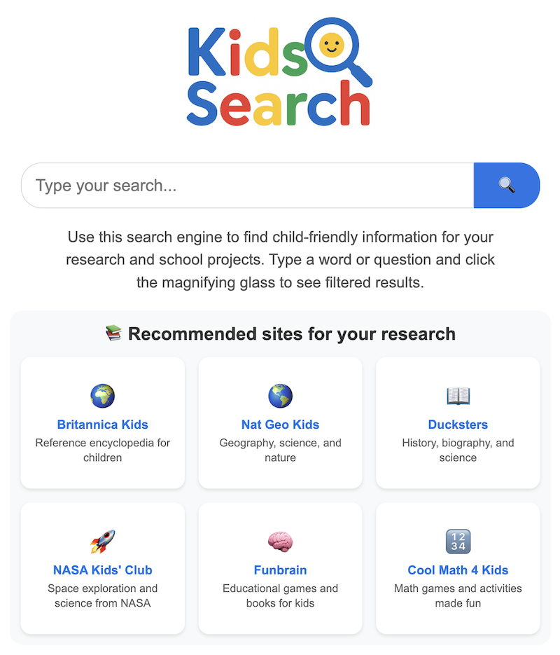

[](https://laurentftech.github.io/kidsearch) [](https://www.buymeacoffee.com/laurentftech)

# KidSearch 🔍

**[➡️ Try the Live Demo!](https://laurentftech.github.io/kidsearch)**

A secure and educational search engine designed for children, using Google Custom Search Engine with filtered results and knowledge panels powered by Vikidia.

It's an ideal solution for a **family, an association, or a school** that wants to offer a controlled and safe search environment for kids. You can even set it as the default search engine in the browser for a fully integrated experience. For example, I run it at home on my Synology NAS to provide a secure search experience for my children.

When combined with Google Family Link (or another whitelist system) on Chrome, you can restrict Internet access to child-friendly websites of your choice (and block direct access to google.com, for example).

<p align="center">
  
</p>

## Features

- **Filtered results**: Only approved educational websites appear
- **Custom autocomplete**: 200+ educational suggestions with keyboard navigation
- **Recommended sites**: Curated selection of quality educational resources
- **Image search**: Image search mode with preview functionality
- **Voice Search**: Search using your voice with the microphone icon.
- **Hybrid Search**: Combines Google CSE with other sources like Vikidia, Wikipedia, Wikimedia Commons, and even your own MeiliSearch instance.
- **Knowledge panels**: Contextual information from Vikidia, Wikipedia, and Wikimedia Commons to enrich results
- **Smart caching**: Intelligent caching system to optimize performance and save API quota
- **Quota management**: Automatic monitoring of Google API usage
- **Language prioritization**: Automatic detection of French or English queries for better results
- **Sort options**: Sort by relevance or date (for web results)
- **Responsive design**: Works on desktop, tablet and mobile
- **Child-friendly interface**: Colorful and user-friendly design with expressive icons
- **No-results suggestions**: Suggests alternative queries when no results are found
- **Optimized pagination**: Efficiently renders pagination for a smoother experience

## Installation

1. **Clone the repository**:
   ```bash
   git clone [your-repo]
   cd search-for-kids
   ```

2. **Configuration**:
   ```bash
   cp config.example.js config.js
   ```

3. **Edit `config.js`** with your Google Custom Search Engine ID, Google API key and knowledge panels configuration:
   ```javascript
   const CONFIG = {
       GOOGLE_CSE_ID: 'your_cse_id_here',
       GOOGLE_API_KEY: 'YOUR_API_KEY_HERE',
       VOICE_SEARCH_ENABLED: true, // Set to false to disable voice search
       KNOWLEDGE_PANEL_CONFIG: {
           ENABLED: true,
           API_URL: 'https://fr.vikidia.org/w/api.php',
           BASE_URL: 'https://fr.vikidia.org/wiki/',
           SOURCE_NAME: 'Vikidia (Encyclopedia for 8-13 year olds)',
           EXTRACT_LENGTH: 300,
           THUMBNAIL_SIZE: 150,
           DISABLE_THUMBNAILS: false
       },
       // Optional: Add your own MeiliSearch instance for custom results
       MEILISEARCH_CONFIG: {
           ENABLED: false, // Set to true to enable
           API_URL: 'https://your-meili-instance.com',
           API_KEY: 'your_meili_search_api_key',
           INDEX_NAME: 'your_index_name',
           SOURCE_NAME: 'My Custom Source',
           WEIGHT: 0.6, // Adjust to prioritize results
           BASE_URLS: ['https://your-website.com'] // Base URLs of indexed sites (to exclude from Google)
       },
       // ... other configs for Wikipedia, Vikidia, etc.
   };
   ```

4. **Host the files on a web server**:
   This project consists of static files and can be hosted on any web server.

   **For local development:**
   You can use a simple local server.
   ```bash
   # With Python 3
   python -m http.server 8000
   
   # Or use the "Live Server" extension in VS Code
   ```
   Then, open `http://localhost:8000` in your browser.

   **For production:**
   Deploy the files on any static web host (e.g., Synology Web Station, Caddy, Apache, Nginx, AWS, GitHub Pages, etc.).

## Google CSE Configuration

1. Go to [Google Custom Search Engine](https://cse.google.com/)
2. Create a new search engine
3. Add your approved sites in "Sites to search"
4. Enable image search in settings
5. Get your CSE ID (format: `xxx:yyyyy`)
6. Get a Google API key from [Google Cloud Console](https://console.cloud.google.com)
7. Paste credentials in `config.js`

**🔒 Security Tip:** Restrict your Google API key to prevent unauthorized use. In your Google Cloud Console, under "Credentials", edit your API key and set "Application restrictions" to "HTTP referrers (web sites)". Add the URL where you host the project (e.g., `your-domain.com/*`).
**💡 Pro Tip:** For a much richer image search experience, add `commons.wikimedia.org` to your list of "Sites to search". Wikimedia Commons is the media library for Wikipedia and contains millions of high-quality educational images that are well-indexed by Google.

## File Structure

```
search-for-kids/
├── index.html              # Homepage with recommended sites
├── results.html            # Results page with web/images tabs
├── style.css               # Main stylesheet
├── search.js              # Main search engine with cache and quota
├── loader.js              # Dynamically loads config.js
├── i18n.js                # Internationalization script
├── knowledge-panels.js    # Vikidia knowledge panels
├── suggestions.json       # Autocomplete suggestions database
├── config.js             # Configuration (not committed)
├── config.example.js     # Configuration example
├── logo.png             # Search engine logo
├── favicon.png          # Site icon
├── README.md            # This file
├── README-fr.md         # French README
└── LICENSE              # MIT License
```

## Advanced Features

### Caching System
- **Persistent cache**: Results are cached in localStorage for 7 days
- **Smart limits**: Maximum 300 cached queries for optimal performance
- **Auto-cleanup**: Automatic removal of expired entries

### API Quota Management
- **Daily monitoring**: Track API usage with 90 requests/day limit
- **Visual indicator**: Real-time display of remaining quota and cache status
- **Protection**: Prevents accidental exceeding of Google limits

### Knowledge Panels
- **Educational source**: Integration with Vikidia, Wikipedia, and Wikimedia Commons for child-appropriate information
- **Smart search**: Tries multiple variants of a query
- **Relevant filtering**: Only displays for appropriate educational queries

### Language Detection
- **French prioritization**: Automatic detection of French queries
- **Better results**: Apply `lang_fr` filter for more relevant results

### Meilisearch Integration
- You can add your own Meilisearch instance to include custom results in your search engine.
- To populate your instance, you can use the companion project [MeilisearchCrawler](https://github.com/laurentftech/MeilisearchCrawler), a web crawler designed to index content for Meilisearch.

## Customization

### Adding Suggestions
Edit `suggestions.json` to add your own search terms:

```json
{
  "suggestions": [
    "new term",
    "another suggestion",
    "dinosaurs",
    "solar system"
  ]
}
```

### Modifying Recommended Sites
In `index.html`, `.recommended-sites` section, add your own educational sites with icons.

### Knowledge Panel Configuration
Customize knowledge panels in `config.js`:
- `ENABLED`: Enable/disable the feature
- `EXTRACT_LENGTH`: Extract length (default: 300 characters)
- `DISABLE_THUMBNAILS`: Disable images if needed

## Technologies Used

- **Frontend**: HTML5, CSS3, JavaScript (ES6+)
- **APIs**: Google Custom Search Engine API, MediaWiki API (Vikidia, Wikipedia)
- **Storage**: localStorage for cache and quota management
- **Design**: CSS Grid/Flexbox, responsive design
- **Features**: Autocomplete, image modal, pagination, sorting

## Security and Privacy

- All results are filtered by Google CSE
- Only pre-approved sites appear
- No personal data collection
- Local cache only (no third-party servers)
- XSS Protection: Result content is sanitized with DOMPurify to block malicious code.
- Child-dedicated interface
- Verified educational sources (Vikidia, Wikipedia)

## Usage

### Basic Search
1. Type your search in the search bar
2. Use autocomplete with ↑↓ arrows and Enter
3. Click 🔍 or press Enter

### Image Search
1. Perform a search
2. Click on the "Images" tab
3. Click on an image to enlarge it

### Sort Options (web results)
1. Click "Tools" under the search bar
2. Choose "Sort by date" for recent results
3. Or keep "Relevance" for best results

## Contribution

### Set as Default Search Engine

For a seamless experience, you can set KidSearch as the default search engine in Chrome, Edge, or any Chromium-based browser.

1.  Go to your browser's **Settings**.
2.  Find the **Search engine** section.
3.  Click on **Manage search engines and site search**.
4.  Next to "Site search," click **Add**.
5.  Fill in the fields as follows:
    *   **Search engine**: `KidSearch`
    *   **Shortcut**: `kid` (or your preferred shortcut)
    *   **URL with %s in place of query**: `https://YOUR_URL/results.html?q=%s`
        > Replace `https://YOUR_URL` with the address where you host the project (e.g., `http://localhost:8000` for local use, or your server's address).

6.  Click **Add**.
7.  Find `KidSearch` in the list, click the three dots (⋮) next to it, and select **Make default**.

Now, all searches from the address bar will use KidSearch!

## Contribution

1. Fork the project
2. Create a branch (`git checkout -b feature/new-feature`)
3. Commit your changes (`git commit -m '''Add new feature'''`)
4. Push to branch (`git push origin feature/new-feature`)
5. Open a Pull Request

## Troubleshooting

### Common Issues
- **No results**: Check your Google CSE configuration and API key
- **Quota exceeded**: Wait until tomorrow or check quota indicator
- **Images not loading**: Check that image search is enabled in Google CSE
- **Missing panels**: Check that `KNOWLEDGE_PANEL_CONFIG.ENABLED` is `true`

### Cache and Performance
- Cache automatically clears after 7 days
- To manually clear: open console and type `localStorage.clear()`
- Quota indicator appears at bottom right of results page

## License

This project is licensed under the MIT License. See the `LICENSE` file for more details.

---

**Created with ❤️ for children's education**
